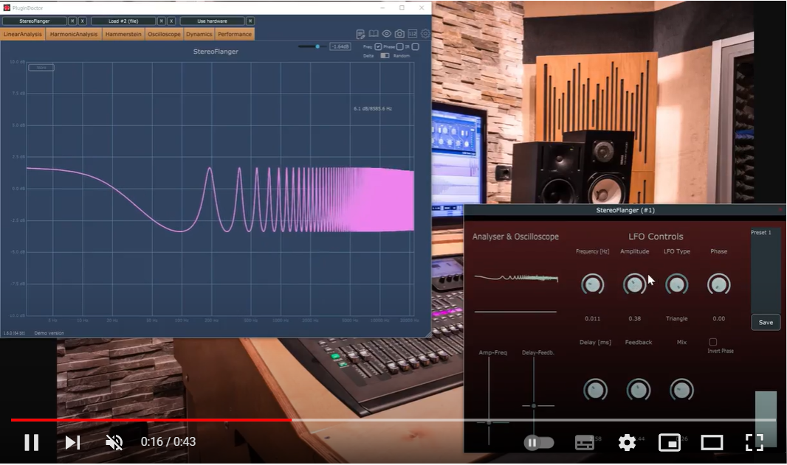

# CMLS-HW2-juce-effect-flanger
Flanger audio effect implemented using Juce, as second homework of the course Computer Music Languages and Systems at Politecnico di Milano (group 10, a.y. 2020/21)

### External libraries
[foleys_gui_magic](https://github.com/ffAudio/foleys_gui_magic/)

### Impulse response

### Frequency response

